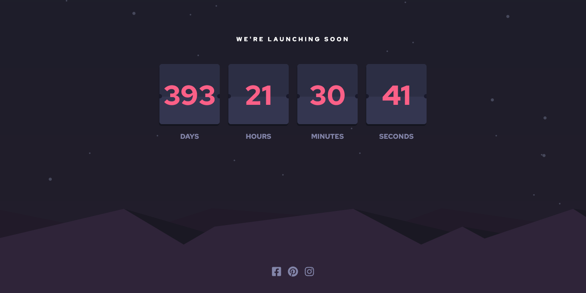

# Frontend Mentor - Room homepage solution

## Table of contents

- [Overview](#overview)
  - [The challenge](#Room-Homepage-solution)
  - [Screenshot](#screenshot)
  - [Links](#links)
- [My process](#my-process)
  - [Built with](#built-with)
  - [What I learned](#what-i-learned)
  - [Continued development](#continued-development)

## Overview

### The challenge

Users should be able to:

- View the optimal layout for the site depending on their device's screen size
- See hover states for all interactive elements on the page
- Navigate the slider using either their mouse/trackpad or keyboard

### Screenshot

Mobile:

Desktop:

### Links

- Solution URL: [https://wesllenbr.github.io/counterdown/](https://wesllenbr.github.io/counterdown/)

## My process

### Built with

- Semantic HTML5 markup
- CSS custom properties
- Flexbox
- CSS Grid
- Mobile-first workflow
- SCSS
- JS

### What I learned

- Get the actual date and time with the object Date()
- Convert date format to milleseconds with getTime()
- Execute a function every time especified with setTimerOut()
- Stop a setTimerOut() function with clearTimer()
- Rotate a element in three-dimensional way with transform: rotateX() or rotateY() or rotateZ()
- Search for DOM(Document Obeject Model) elements that are being changed with MutationObserver()
- DOM is a programming interface for web documents
- To pad a start of a string with another string until it reaches a given length using padStart()

### Continued development

- Would be nice if this project becomed a real world project. A countdown for every holyday or date especific that you want, but in a way more friendly, more beautiful and with more features. 